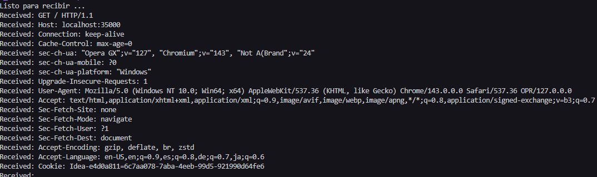
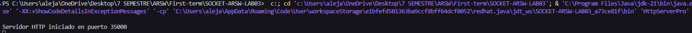
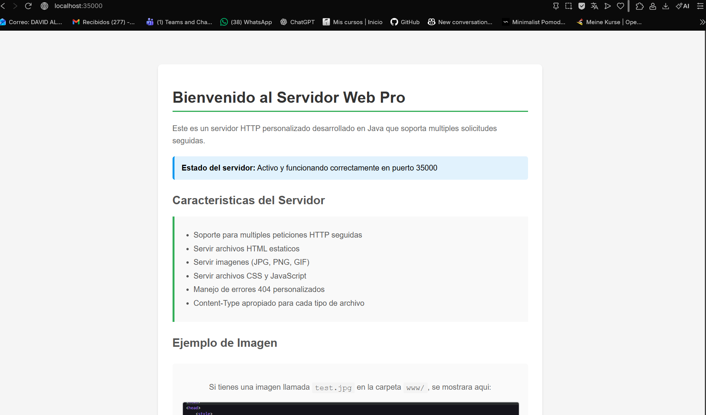
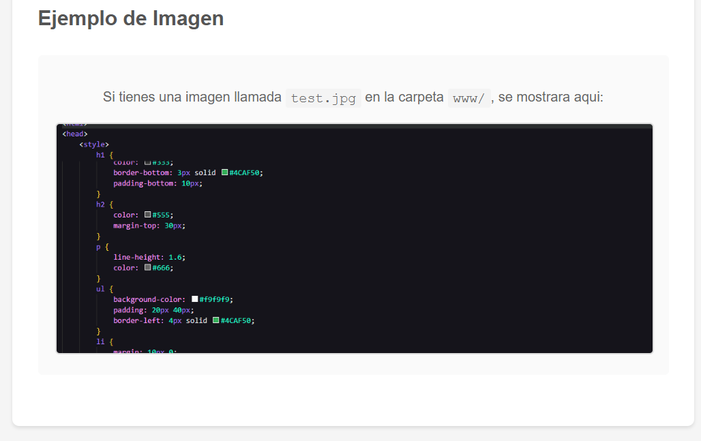
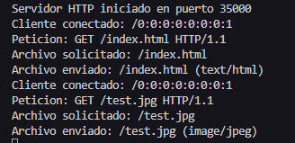
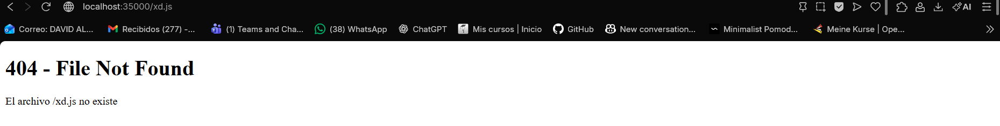
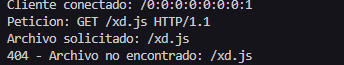

# SOCKET-ARSW-LAB03

## Descripcion ejercicio 4.3.1
Ejercicio basico de cliente-servidor con sockets en Java. El cliente envia un numero entero y el servidor responde con su cuadrado.

## Estructura
- [EchoServer.java](EchoServer.java): servidor TCP que recibe enteros y devuelve el cuadrado.
- [EchoClient.java](EchoClient.java): cliente TCP que envia el numero digitado y muestra la respuesta.

## Funcionamiento del codigo
### Servidor
- Abre un `ServerSocket` en el puerto 35000.
- Espera una conexion con `accept()`.
- Lee lineas con `BufferedReader`.
- Convierte la entrada a entero con `Integer.parseInt`.
- Calcula el cuadrado con `n * n`.
- Responde con un `PrintWriter`.

### Cliente
- Crea un `Socket` hacia la IP configurada y el puerto 35000.
- Lee la entrada del usuario desde consola.
- Envia la linea al servidor.
- Muestra la respuesta del servidor en consola.

## Notas
- La IP del servidor esta fija en [EchoClient.java](EchoClient.java); ajustala a tu red si es necesario.
- El servidor espera entradas numericas; si envias texto no numerico lanzara una excepcion.

---

## Descripcion del Ejercicio 4.3.2

El servidor puede recibir numeros y responde con operaciones trigonometricas sobre estos. El servidor acepta mensajes que empiezan con "fun:" para cambiar la operacion actual. Por defecto calcula el coseno.

**Funciones disponibles:**
- Seno (sin)
- Coseno (cos) - operacion por defecto
- Tangente (tan)
- Todas las anteriores (fun:)

## Ejecucion

### Iniciar el Servidor

```bash
java FunServer
```

Salida esperada:
```
Servidor iniciado en puerto 35000
```

### Iniciar el Cliente

```bash
java FunClient
```

Salida esperada:
```
CLIENTE DE FUNCIONES TRIGONOMETRICAS
Operaciones disponibles:
  fun:     - Calcular sen, cos y tan
  fun:sin  - Modo seno
  fun:cos  - Modo coseno
  fun:tan  - Modo tangente

Ingrese el modo seguido del numero a calcular
Escriba 'exit' o 'quit' para salir
```

## Ejemplos de Uso

### Ejemplo 1: Calculo de coseno por defecto

```
Usuario: 0
Servidor: Cos: 1.000000

Usuario: 1.5707963267948966
Servidor: Cos: 0.000000
```

### Ejemplo 2: Cambio a modo seno

```
Usuario: fun:sin
Servidor: Modo operacion sin

Usuario: 0
Servidor: Sen: 0.000000

Usuario: 1.5707963267948966
Servidor: Sen: 1.000000
```

### Ejemplo 3: Cambio a modo tangente

```
Usuario: fun:tan
Servidor: Modo operacion tan

Usuario: 0
Servidor: Tan: 0.000000

Usuario: 0.7853981633974483
Servidor: Tan: 1.000000
```

### Ejemplo 4: Modo completo (todas las funciones)

```
Usuario: fun:
Servidor: Modo operacion sen, cos, tan

Usuario: 0
Servidor: Sen: 0.000000 Cos: 1.000000 Tan: 0.000000

Usuario: 1.5707963267948966
Servidor: Sen: 1.000000 Cos: 0.000000 Tan: 16331239353195370.000000
```

### Ejemplo 5: Secuencia completa del enunciado

```
Usuario: 0
Servidor: Cos: 1.000000

Usuario: 1.5707963267948966
Servidor: Cos: 0.000000

Usuario: fun:sin
Servidor: Modo operacion sin

Usuario: 0
Servidor: Sen: 0.000000
```

## Configuracion

### Modificar IP y Puerto

En `FunClient.java`:
```java
private static final String SERVER_HOST = "192.168.2.58";  // Cambiar IP
private static final int SERVER_PORT = 35000;              // Cambiar puerto
```

En `FunServer.java`:
```java
private static final int PORT = 35000;  // Cambiar puerto
```

### Descripcion del Ejercicio 4.4
Implementacion de un servidor HTTP básico en Java usando sockets.  
El servidor escucha conexiones en un puerto específico, recibe una solicitud HTTP desde un navegador y responde enviando una página HTML sencilla.

## ¿Qué hace el código?

En `HttpServer.java`:

1. Abre un puerto (35000) en la máquina local.
2. Espera a que un cliente (por ejemplo, un navegador web) se conecte.
3. Lee la solicitud HTTP enviada por el navegador.
4. Muestra la solicitud en consola.
5. Envía una respuesta HTML al cliente.
6. Cierra la conexión.

## Como conectarse al servidor desde el navegador

1. Compila y ejecuta `HttpServer.java`.
2. En la consola deberia de aparecer `Listo para recibir ...`
3. Desde el navegador conectarse al servidor `http://localhost:35000`
4. En la consola deberia de imprimir la informacion de la solicitud HTTP 


--- 
## Descripcion del Ejercicio 4.5:

**Servidor Web HTTP en Java**: Implementacion de un servidor HTTP basico en Java que soporta multiples solicitudes seguidas (no concurrentes) y sirve archivos incluyendo HTML, imagenes y otros recursos.

## Descripcion del Ejercicio

Desarrollar un servidor web que cumpla con los siguientes requisitos:
- Soportar multiples solicitudes HTTP seguidas (una a la vez)
- Retornar archivos HTML solicitados por el cliente
- Retornar imagenes y otros recursos
- Enviar headers HTTP correctos segun el tipo de archivo
- Manejar errores 404 cuando un archivo no existe

### Componentes Principales

```
Cliente (Navegador)  →  Peticion HTTP GET  →  Servidor Java
                                               ↓
                                          Buscar archivo
                                               ↓
                                    ¿Archivo existe?
                                      /           \
                                    SI            NO
                                    ↓              ↓
                              200 OK          404 Not Found
                                    ↓              ↓
Cliente (Navegador)  ←  Respuesta HTTP  ←  Servidor Java
```

### Flujo de Ejecucion

1. **Inicializacion**: Servidor abre puerto 35000 y queda en escucha
2. **Aceptacion**: Espera conexion de cliente (bloqueante)
3. **Lectura**: Lee peticion HTTP del cliente
4. **Parsing**: Extrae ruta del archivo solicitado
5. **Busqueda**: Verifica existencia del archivo en carpeta `www/`
6. **Respuesta**: Envia archivo o error 404
7. **Cierre**: Cierra conexion con cliente
8. **Repeticion**: Vuelve al paso 2 (bucle infinito)

## Estructura 

```
├── HttpServerPro.java    # Servidor HTTP principal
└── www/                  # Directorio de archivos publicos
    ├── index.html        # Pagina principal
    ├── page2.html        # Pagina secundaria
    ├── test.jpg          # Imagen de ejemplo (opcional)
    └── [otros archivos]  # CSS, JS, imagenes adicionales
```
## Compilacion y Ejecucion

### Compilar el Servidor
```bash
javac HttpServerPro.java
```

### Ejecutar el Servidor
```bash
java HttpServerPro
```

Salida esperada:
```
Servidor HTTP iniciado en puerto 35000
```

### Detener el Servidor
```
Ctrl + C
```

## Pruebas

Ejecucion del servidor:


Buscar en el navegador: `http://localhost:35000`
   


Salida en consola con los recursos encontrados:  



Buscar un recurso inexistente: `http://localhost:35000/xd.js`  



Salida en consola con error 404 de recurso no encontrado:  

